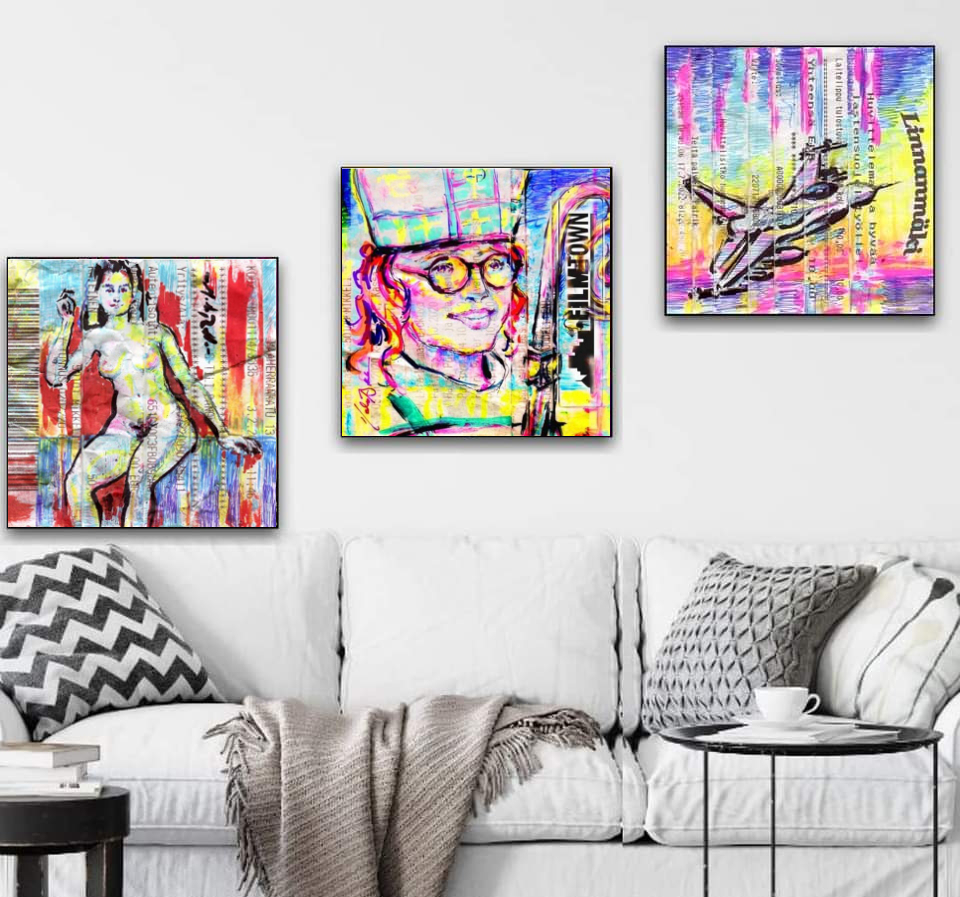

<!DOCTYPE html>
<html lang="fi">
<head>
    <meta charset="UTF-8">
    <meta name="viewport" content="width=device-width, initial-scale=1.0">
    <title>Taidegalleria - 1950-luku</title>
    <link href="https://fonts.googleapis.com/css2?family=Lobster&family=Special+Elite&family=Playfair+Display:wght@700&display=swap" rel="stylesheet">
    
</head>
<body>

    

        

        

            <h1>Modernia Väriä & Muotoa</h1>

            

                
                

                    <h2>Abstrakti Unelma</h2>
                    
Tämä teos edustaa aikakauden dynaamista otetta, jossa värit kohtaavat vapaan muodon. Teos on toteutettu sekatekniikalla alkuperäiselle 50-luvun sanomalehtipaperille.

                

            

            

                
                

                    <h2>Urbaani Syke</h2>
                    
Katunäkymä, joka on suodatettu pop-taiteen esi-isien linssin läpi. Voimakkaat kontrastit ja typografiset elementit luovat syvyyttä ja tarinaa jokaisella siveltimenvedolla.

                

            

            

                
                

                    <h2>Piispan Hymy</h2>
                    
Hahmotutkielma, jossa yhdistyvät klassinen muotokuvataide ja moderni katutaide. Väripaletti on poimittu suoraan vanhoista matkailujulisteista.

                

            

            

                
                

                    <h2>Linnunrata</h2>
                    
Lennokas ja energinen sommitelma, joka johdattaa katsojan läpi aikakauden optimismin ja teknologisen murroksen. Teos, joka herättää huoneen eloon.

                

            

        

    

</body>
</html>
